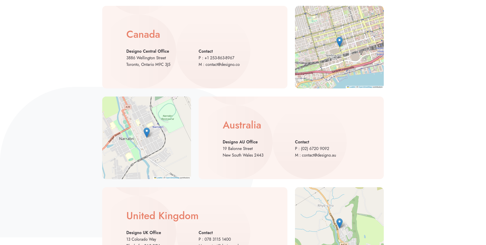
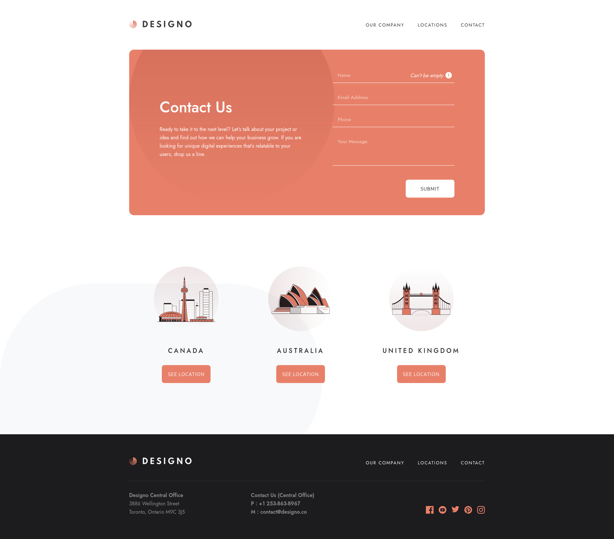

# Frontend Mentor - Designo multi-page website solution

Completed my first guru difficulty frontend mentor challenge. The start was pretty slow, mainly because I was still new to `typescript` and barely knew anything about `nextjs`. On top of that putting the two together. Then I also added component level styles, which was also a new thing for me. But once I got a little more comfortable with all this stuff, things started moving a little faster.

I have mixed component level styles and global styles in this project. For things that are shared accross multiple components or pages, like header and footer, I used global styles and for the rest of the components I used component level styles. I did use inline styles at a couple places for a background pattern image, to position slightly differently from other pages.

I didn't really have any big challenges in this project. The main challenge was just using things I am not that familiar with or have never even used before. Things I would do differently if I had to start over, I would use more global styles than component level styles or maybe only global styles. Did not really like them that much. Another thing would like to try would [styled components](https://styled-components.com/).

And here's just a copy of my `README` for that challenge, that is also available on my `GitHub` repo page.

## Table of contents

- [Overview](#overview)
  - [The challenge](#the-challenge)
  - [Screenshot](#screenshot)
  - [Links](#links)
- [My process](#my-process)
  - [Built with](#built-with)
  - [Useful resources](#useful-resources)
- [Author](#author)

## Overview

### The challenge

Users should be able to:

- View the optimal layout for each page depending on their device's screen size
- See hover states for all interactive elements throughout the site
- Receive an error message when the contact form is submitted if:
  - The `Name`, `Email Address` or `Your Message` fields are empty should show "Can't be empty"
  - The `Email Address` is not formatted correctly should show "Please use a valid email address"
- **Bonus**: View actual locations on the locations page maps (we recommend [Leaflet JS](https://leafletjs.com/) for this)

### Screenshot

### Links

- Solution URL: [URL](https://www.frontendmentor.io/solutions/designo-website-Jw2b8rQ5ZO)
- Live Site URL: [URL](https://designo-multi-page-website-frontendmentor.vercel.app/)

## My process

### Built with

- Flexbox
- CSS Grid
- Mobile-first workflow
- TypeScript
- SASS
- [Next.js](https://nextjs.org/) - React framework

### Useful resources

- [NextJS/TypeScript](https://nextjs.org/docs/basic-features/typescript)
- [Forms/TypeScript](https://react-typescript-cheatsheet.netlify.app/docs/basic/getting-started/forms_and_events/)

## Author

- Website - [Deividas Rimkus](https://deividas.blog)
- Frontend Mentor - [@Lisviks](https://www.frontendmentor.io/profile/Lisviks)
- Twitter - [@DRimkusDev](https://www.twitter.com/DRimkusDev)
- GitHub - [Lisviks](https://github.com/Lisviks)
