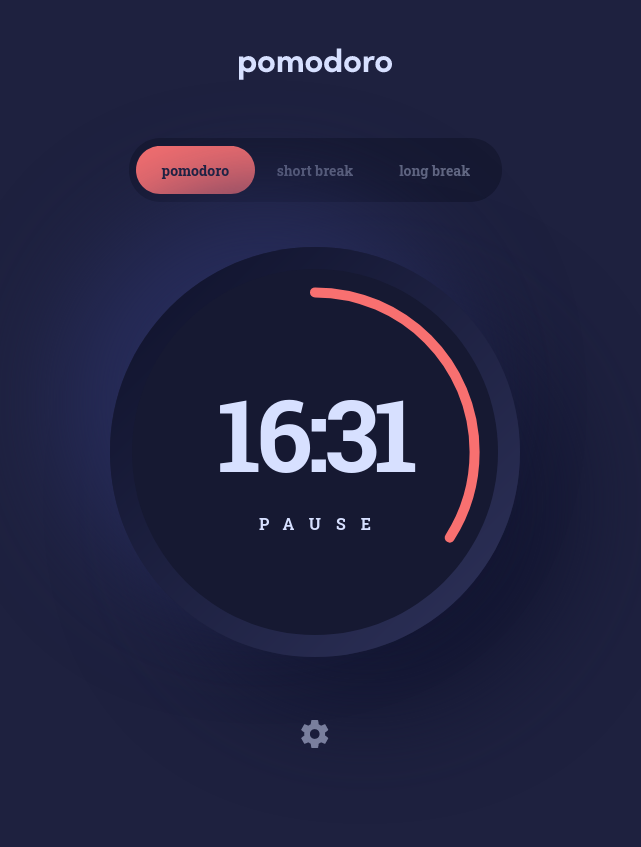
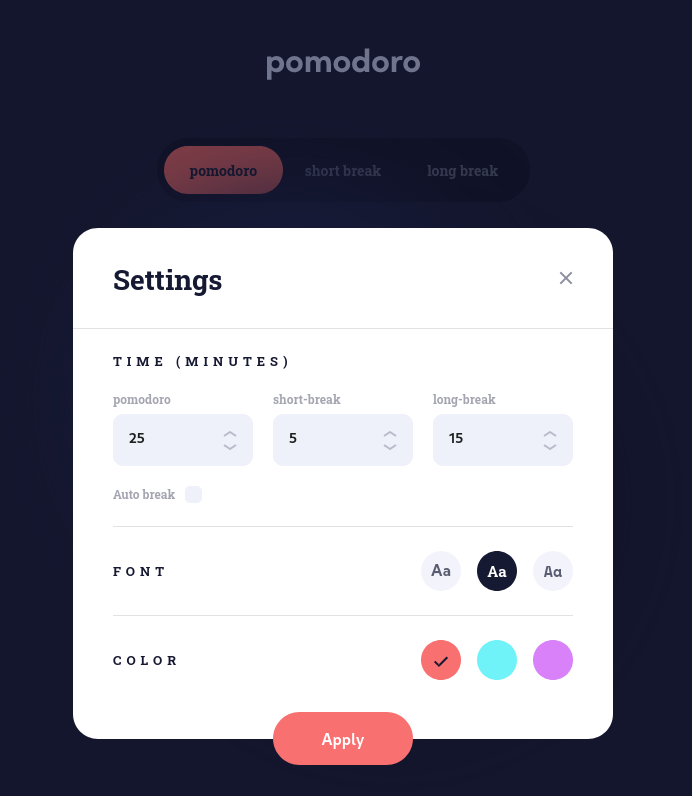

# Frontend Mentor - Pomodoro app solution

This is my solution to the [Pomodoro app challenge on Frontend Mentor](https://www.frontendmentor.io/challenges/pomodoro-app-KBFnycJ6G). According to wakatime I spent about 14 hours. It doesn't include the time I spent looking up errors and other things, only time spent coding. Here are some of my wakatime stats:

- TypeScript - 6h 57m
- SCSS - 4h 10m
- HTML - 1h 44m
- Markdown - 35m

I think the biggest challenge I had was creating a circular progress bar. This [Medium article](https://medium.com/@pppped/how-to-code-a-responsive-circular-percentage-chart-with-svg-and-css-3632f8cd7705) helped me to make it.

## Table of contents

- [Overview](#overview)
  - [The challenge](#the-challenge)
  - [Screenshot](#screenshot)
  - [Links](#links)
- [My process](#my-process)
  - [Built with](#built-with)
  - [Useful resources](#useful-resources)
- [Author](#author)

## Overview

### The challenge

Users should be able to:

- Set a pomodoro timer and short & long break timers
- Customize how long each timer runs for
- See a circular progress bar that updates every minute and represents how far through their timer they are
- Customize the appearance of the app with the ability to set preferences for colors and fonts

### Screenshot

### Links

- Solution URL: [URL](https://www.frontendmentor.io/solutions/pomodoro-app-DLEUDjXW-I)
- Live Site URL: [URL](https://lisviks.github.io/pomodoro-app-frontendmentor/)

## My process

### Built with

- CSS custom properties
- Flexbox
- Mobile-first workflow
- Typescript
- SASS
- Vite build tool

### Useful resources

- [Custom Checkbox](https://www.w3schools.com/howto/tryit.asp?filename=tryhow_css_custom_checkbox)
- [Circular Progress Bar](https://codepen.io/sergiopedercini/pen/aWawra)
- [Vite Deploy to GitHub Pages](https://github.com/sitek94/vite-deploy-demo)

## Author

- Website - [Deividas Rimkus](https://deividas.blog)
- Frontend Mentor - [@Lisviks](https://www.frontendmentor.io/profile/Lisviks)
- Twitter - [@DRimkusDev](https://www.twitter.com/DRimkusDev)
- GitHub - [Lisviks](https://github.com/Lisviks)
